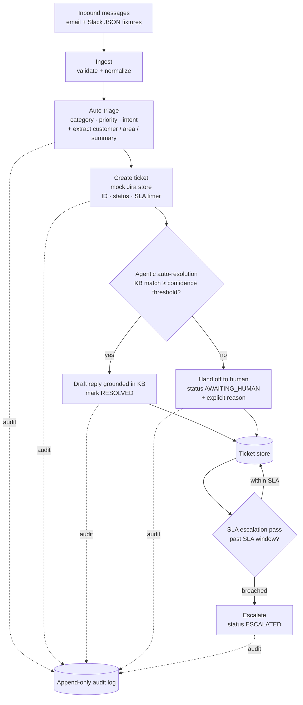

# support-ticket-router

**Agentic support automation that triages inbound messages, opens tickets, auto-resolves what it can from a knowledge base, and escalates anything that breaches its SLA — running fully offline with zero secrets, or with a real Claude model when you give it a key.**

Support inboxes are mostly the same five questions and a handful of genuine fires. This project is a small, runnable agent that reads inbound email + Slack messages, classifies and prioritizes them, drafts a grounded reply when the knowledge base actually has the answer, hands off to a human (with a clear reason) when it doesn't, and escalates tickets that sit past their SLA window. Everything is synthetic — a fictional SaaS product called **Acme Cloud** with customers Alex, Jordan, and Sam at `example.com`.

The headline design choice: **it degrades gracefully**. With no `ANTHROPIC_API_KEY`, the whole pipeline runs in a clearly-labeled deterministic MOCK mode (keyword heuristics that mirror the LLM's output shape), so the demo and the entire test suite run in CI with no network and no secrets. Set a key and the same pipeline routes through Claude with structured outputs instead.

---

## How it works



Two execution paths share the same pipeline:

| Path | When | Triage & resolution |
|------|------|---------------------|
| **MOCK** (default) | `ANTHROPIC_API_KEY` absent | Deterministic keyword heuristics. Prints `[MOCK MODE — set ANTHROPIC_API_KEY for real LLM]`. |
| **LLM** | `ANTHROPIC_API_KEY` set | Claude (`claude-opus-4-8`) with adaptive thinking + structured JSON outputs. Falls back to MOCK on any API error so the pipeline never hard-fails. |

---

## Quickstart

```bash
git clone <this-repo> && cd support-ticket-router

python -m venv .venv && source .venv/bin/activate
pip install -r requirements.txt

# Everything below runs offline in MOCK mode — no key required.
python -m router ingest          # load + validate the sample fixtures
python -m router run             # triage + ticket + auto-resolve / handoff
python -m router tickets         # list all tickets with status + SLA
python -m router ticket TCK-0001 # one ticket in detail (incl. drafted reply)
python -m router escalations     # run the SLA escalation pass
python -m router audit           # the append-only audit log
```

The CLI is also installable as a `router` entry point (`pip install -e .` then `router run`).

Runtime state (the ticket store and audit log) lives under `./data/` by default; override with `--data-dir /tmp/demo`.

To use the real model:

```bash
cp .env.example .env        # then set ANTHROPIC_API_KEY
export ANTHROPIC_API_KEY=sk-ant-...
python -m router run        # now routes through Claude
```

---

## Example runs (expected-shape output)

### 1. `run` — the full pipeline (MOCK mode)

```
[MOCK MODE — set ANTHROPIC_API_KEY for real LLM]
                                Pipeline results
 Ticket    Priority   Category          Outcome         Conf   Summary
 TCK-0001  high       how_to            auto-resolved   0.67   How do I reset my API key?
 TCK-0002  urgent     outage            handoff         0.00   URGENT: Production is down — 503...
 TCK-0003  high       billing           auto-resolved   0.80   Double charged on my invoice...
 TCK-0004  low        feature_request   handoff         0.00   Feature idea: dark mode...
 TCK-0005  high       account           auto-resolved   0.60   #support thread
 TCK-0006  high       bug               auto-resolved   0.67   #support thread

4 auto-resolved, 2 handed off to a human.
```

The outage and the feature request are *correctly* handed off: the KB has no article that confidently answers "production is down" or "please build dark mode", so the agent declines to auto-reply rather than guess.

### 2. `ticket TCK-0001` — a resolved ticket with its drafted reply

```
╭─────────────── Ticket TCK-0001 ───────────────╮
│ TCK-0001  (resolved)                          │
│ Customer : Alex Rivera <alex@example.com>     │
│ Priority : high   Category: how_to            │
│ SLA due  : 2026-06-19T08:43:27+00:00          │
│ KB match : kb-001                             │
╰───────────────────────────────────────────────╯
╭──────────────── Drafted reply ────────────────╮
│ Hi Alex,                                      │
│ Thanks for reaching out. To regenerate your   │
│ API key, go to Settings > Developer > API     │
│ Keys ...                                       │
│ — Acme Cloud Support                          │
╰───────────────────────────────────────────────╯
```

### 3. `escalations` — the SLA pass

```
[MOCK MODE — set ANTHROPIC_API_KEY for real LLM]
         0 escalated tickets
No new SLA breaches this pass.
```

Escalation is time-driven: a ticket is only escalated once real wall-clock time passes its SLA window. Immediately after `run`, every ticket is still within SLA, so the pass is a no-op. The escalation trigger is proven deterministically in the tests using an injectable clock (see below) — `tests/test_escalation.py` advances a `FixedClock` past the SLA window and asserts the status flips to `ESCALATED`.

### 4. `audit` — the append-only log

```
 Timestamp                  Action          Details
 2026-06-19T04:43:27+00:00  triage          message_id=email-1001, category=how_to, priority=high, ...
 2026-06-19T04:43:27+00:00  ticket_created  ticket_id=TCK-0001, sla_due_at=..., priority=high
 2026-06-19T04:43:27+00:00  auto_resolved   ticket_id=TCK-0001, kb_article_id=kb-001, confidence=0.667
 ...
```

### 5. `run` again — idempotency

Re-running `run` against the same store skips messages already ticketed (matched by `message_id`) rather than creating duplicates — each appears as `skipped (exists)`.

---

## Escalation policy

Every ticket gets an SLA window from its priority. A ticket still `open` or `awaiting_human` when its window elapses is **escalated** (`status → escalated`, audited). Resolved and already-escalated tickets are never re-flagged.

| Priority | SLA window | Typical trigger |
|----------|-----------|-----------------|
| `urgent` | 60 minutes | outage, data loss, "all customers affected" |
| `high`   | 4 hours    | blocked workflow, billing dispute, auth bug |
| `normal` | 24 hours   | routine how-to question |
| `low`    | 72 hours   | feature request, nice-to-have |

The `escalations` command runs one pass: it finds breached tickets, flips their status, and writes an audit entry. Run it on a schedule (cron, a worker loop) in a real deployment.

---

## Auto-resolution & confidence gating

The agent only auto-replies when it is confident the KB actually answers the question:

- **MOCK path** scores each KB article by keyword overlap (`hits / total_keywords`). The best match above the threshold (`0.6`) wins; below it, the ticket is handed off with the score in the reason.
- **LLM path** hands Claude the candidate articles and asks it to (a) pick the best one, (b) judge whether it genuinely answers the question, and (c) draft a reply grounded *only* in that article. It auto-resolves only when `answers_question` is true **and** confidence clears the threshold.

The bias is deliberately conservative: a wrong auto-reply is worse than an honest handoff, so anything ambiguous goes to a human with a stated reason.

---

## Project layout

```
router/
  cli.py          # `router` entrypoint: ingest / run / tickets / ticket / escalations / audit
  pipeline.py     # orchestrator: ingest → triage → ticket → resolve/handoff
  ingest.py       # load + validate email/Slack fixtures (pydantic at the boundary)
  triage.py       # classify category/priority/intent; LLM + deterministic mock
  resolve.py      # KB-grounded auto-resolution with confidence gating
  kb.py           # synthetic KB loading + keyword scoring
  escalation.py   # SLA policy + escalation pass
  store.py        # mock "Jira" ticket store (local JSON)
  audit.py        # append-only audit log
  models.py       # domain models (StrEnum + dataclasses)
  clock.py        # injectable clock (SystemClock / FixedClock) for deterministic SLA tests
  llm.py          # the only module that imports the anthropic SDK
  config.py       # env-driven config + mock-mode detection
sample_data/      # synthetic email + Slack fixtures + KB articles
tests/            # pytest suite — runs in mock mode, no network
```

---

## Tests

```bash
pip install -r requirements-dev.txt
pytest -q          # 20 tests, fully offline
ruff check .       # lint
```

The suite covers triage classification, ticket creation, auto-resolve-vs-handoff gating, SLA escalation triggers (via the injectable clock), idempotent reprocessing, audit appends, and ingest validation. SLA timing never touches wall-clock in tests — a `FixedClock` is advanced explicitly.

---

## Stack

- **Python 3.11+**
- **pydantic** — input validation at the ingest boundary
- **rich** — CLI tables and panels
- **anthropic** *(optional)* — only for the real LLM path; the project is fully functional without it
- **pytest** + **ruff** — tests and linting

Default model: `claude-opus-4-8` (override with `MODEL_ID`). The LLM path uses adaptive thinking and structured JSON outputs.

---

## Roadmap

- Real connectors (IMAP / Slack Events API) behind the same `InboundMessage` boundary
- Vector / embedding KB retrieval instead of keyword overlap
- A worker loop that runs the escalation pass on a schedule and notifies on-call
- Reply *sending* (currently the agent drafts; a human approves) with an approval gate
- Per-customer SLA overrides and business-hours-aware timers

---

## About

This is a **portfolio demonstration**, not a production support desk. It is deliberately self-contained and synthetic:

- All data is fictional (Acme Cloud; Alex/Jordan/Sam at `example.com`). No real customers, tickets, or knowledge base.
- The "ticket store" is a local JSON file, not Jira; connectors are mocked.
- The mock-mode heuristics are intentionally simple keyword rules — they exist so the system is runnable and testable with zero secrets, not as a replacement for the LLM's judgment.
- Confidence thresholds and SLA windows are illustrative defaults.

What it's meant to show: a clean agentic pipeline with confidence-gated auto-resolution, an honest human-handoff path, deterministic SLA logic with an injectable clock, an audit trail, and a real/mock split that keeps the whole thing CI-friendly and offline-first.

## Origin

This is a **clean-room, generic version** of tooling I build and use locally for real operational and process work. The internal originals stay private; this public version is sanitized — synthetic data only, no proprietary logic — and generalized so anyone (including me) can reuse it via [Claude Code](https://claude.com/claude-code). Built and maintained AI-assisted.
